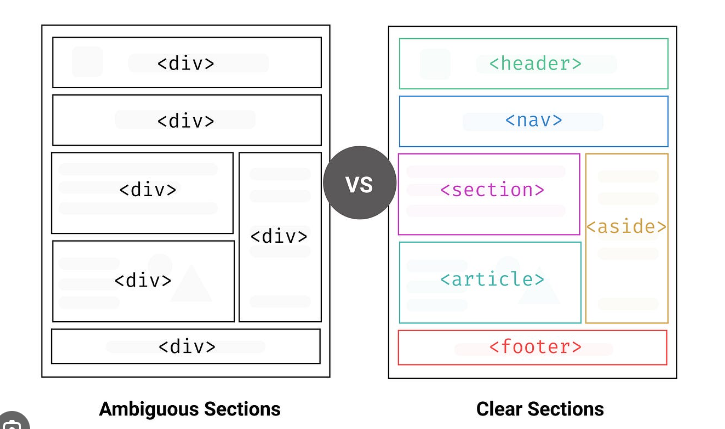

# HTML5
## 이미지 연결
#### 이미지 태그
```html


```
속성 | 사용값 | 설명
:--- |:----|:---------------------------------------
width|pixel|이미지 너비 지정
height|pixel|이미지 높이 지정
src|URL|이미지 경로 지정
alt|문자열|이미지를 대체하는 텍스트 내용 입력
crossorigin|anonymous|다른 사이트에서 스크립트로 <canvas\> 안에 이미지를 접근해 끌어와 사용할 수 있도록 허용할지 여부
ismap|ismap|이미지가 서버사이드 이미지맵의 일부인지 여부를 표시
longdesc| |이미지의 상세 설명을 담은 URL을 지정
sizes| |각각의 페이지 레이아웃 크기 별 이미지 크기 지정
srcset|URL|size 속성과 함께 사용 가능<br>다양한 상황에서 사용할 수 있는 이미지 URL을 지정, 반응형 웹 또는 다양한 해상도의 이미지를 표시해야 하는 경우 해상도별 이미지 경로를 세트로 표시해 조건에 맞춰 표시되도록 할 수 있음
usemap|#mapname|이미지 맵 ID를 지정
id|문자열|이미지 고유 ID 표시

#### 사라지는 이미지 속성
###### align, border, hspace, vspace 속성들을 사용되지 않음

#### 태그끝에 "/" 붙이기
###### 태그 쌍 없는 단독 태그의 경우 과거에는 "/"를 써서 단독 태그로 끝난다는 표시를 해야했으나 안해도 됨
```html
 표기하던 태그는  로 사용하면 됨
```

## 하이퍼링크 \<a>로 HTML 문서 연결
#### 하이퍼링크를 통해 연결형 문서가 되며 다른 위치나 다른 문서로 즉시 이동할 수 있음
```html
<a href="https://google.com">구글로 이동</a>
```
#### 상대 경로와 절대 경로
###### 현재 위치를 기준으로 경로가 결정되고 기준이 되는 현재 위치를 "베이스 URL"이라고 합니다.
* 상대경로 : 자신의 위치를 기준(".", "..", "/"로 시작)으로 상대적인 위치를 표시함
* 절대경로 : 전체 경로를 할당

## Web에서 사용할 수 있는 이미지 포맷들
#### 이미지 포맷은 "jpg", "gif", "png", "svg" 가능 하며 해당 포맷을 제외한 이미지 파일은 Web/Internet에서 사용하면 안됨

#### jpg(jpeg)
###### 고해상도 고 컬러 이미지를 인터넷 상에 사용하기 위한 이미지 포맷
###### 손실 압축 방식으로 압축율에 따라 이미지 손상될 수 있음
###### 투명 배경을 지정할 수 없음

#### gif
###### 무손실 압축 이미지 포맷임
###### 작은 아이콘, 저해상도 이미지, 컬러수가 적은 이미지, 배경을 단색으로 투명처리 해야하는 이미지에 사용
###### 최대 컬러 수가 256컬러로 제한되어 있어 사용한 색상이 많은 이미지를 저장하면 이미지가 심하게 층이 지어 보이거니 디더링(Dithering)될 수 있음
###### png로 대체 되고 있으며 특허 문제 등으로 인해 사용이 줄어듬

#### png(Portable Network Graphics)
###### 최근 덜어 jpg와 함께 가장 많이 사용하는 웹 표준 이미지 포맷
###### gif처럼 투명 배경 이미지를 만들 수 있음 
###### 24bit 트루 컬러를 지원하며 사용 컬러 수의 제약도 없음
###### gif를 완전히 대체 할 수 있어 gif보다는 png 이미지 포맷 사용을 추천함
###### png 이미지 포맷을 기본으로 사용하면 됨

#### svg
###### 웹 표준에서 지원하는 유일한 벡터 이미지 포맷임

## 시멘틱 태그
#### 시맨틱 태그란?
###### 시맨틱 태그는 반드시 사용해야함. 사용 시 검색 결과에 좋은 영향을 주지만 사용하지 않아도 문제는 없음
###### 특정 섹션이 어떤 용도로 사용한 부분인지 바로 알 수 있음(사용 안할 시 div를 사용하기 때문에 명확히 알 수 없음)
###### 검색 엔진은 시맨틱 태그를 기준으로 웹 페이지의 내용을 판단하고 인덱싱 함 시멘틱 태그 종류에 따라 중요 정보 여부 판단하여 우선순위에 반영
###### 문서 구조를 일관되게 파악할 수 있고 표준화된 CSS를 작성하는데 도움을 줌

#### 시맨틱 태그 리스트
```html
중요 <article></article>
중요 <aside></aside>
<details></details>
<figcaption></figcaption>
<figure></figure>
중요 <footer></footer>
중요 <header></header>
중요 <main></main>
<mark></mark>
중요 <nav></nav>
중요 <section></section>
<summary></summary>
<time></time>
```

#### 시멘틱 태그 영역


#### 시멘틱 태그 예
```html
<html>
<head>
    <meta charset="utf-8">
    <title>Symantic HTML</title>    
</head>
<body>
    <header></header>
    <nav></nav>
    <main>
        <section></section>
        <article></article>
        <aside></aside>
    </main>
    <footer></footer>
</body>
</html>
```

###### 시멘틱 태그로 만든 HTML 문서 구조는 CSS를 이용하여 배치를 자유롭게 변경할 수 있음
###### <nav> 태그로 정의된 메뉴는 웹페이지 하단에 배치하거나 할 수 있음